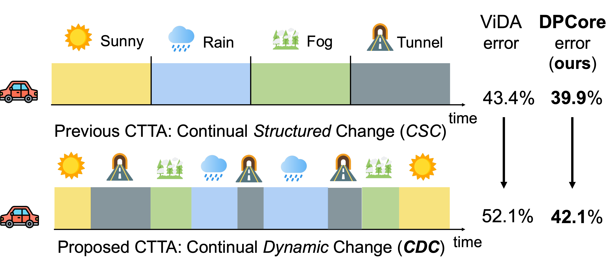
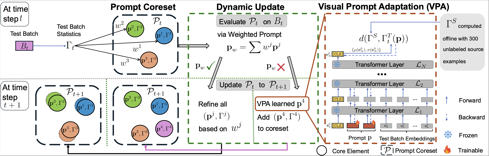

# DPCore: Dynamic Prompt Coreset for Continual Test-Time Adaptation

[](https://arxiv.org/abs/2406.10737)
[](https://icml.cc/Conferences/2025) 

**Authors:** Yunbei Zhang, Akshay Mehra, Shuaicheng Niu, Jihun Hamm

---

## ⚙️ Settings
Continual Test-Time Adaptation (CTTA) aims to adapt source pre-trained models to continually changing, unseen target domains. However, existing methods often struggle with dynamic conditions, facing issues like convergence problems, catastrophic forgetting, or misapplying knowledge. 

<p align="center">
  
</p>

Illustrated through an autonomous driving scenario where a vehicle encounters varying weather and lighting conditions. The top panel shows the conventional CSC setting with structured, uniform-length domain transitions, while the bottom panel illustrates our proposed CDC setting where domains recur with varying frequencies and durations—better reflecting real-world challenges.  When evaluated on ImageNet-to-ImageNet-C with ViT base model, previous SOTA ViDA's error rate increases significantly from 43.4% to 52.1% when moving from CSC to CDC, while DPCore maintains robust performance (39.9% to 42.1%).

## 🔎 Overview of DPCore
**DPCore** is a novel method designed for robust performance across diverse domain change patterns while ensuring computational efficiency. It integrates three key components:
1.  **Visual Prompt Adaptation:** For efficient domain alignment with minimal parameters.
2.  **Prompt Coreset:** For preserving knowledge from previous domains and accommodating new ones.
3.  **Dynamic Update Mechanism:** To intelligently adjust existing prompts for similar domains or create new ones for substantially different domains.

<p align="center">
  
</p>

At time step $t$, the **Prompt Coreset** $P_t$ (upper left) maintains core elements consisting of learned prompts $p^j$ and statistics $\Gamma^j$ from previous domains. The **Dynamic Update** mechanism (middle) evaluates a new test batch $B_t$ by computing a weighted prompt $p_w$ based on distances between batch statistics $\Gamma_t$ and core element statistics $\Gamma^j$. If $p_w$ performs well, existing core elements $\{p^j, \Gamma^j\}$ are refined using weights $w^j$. Otherwise, **Visual Prompt Adaptation** (right) learns a new prompt by aligning the test batch with source statistics (computed offline from 300 examples) and adds this new prompt to the prompt coreset. The updated coreset $P_{t+1}$ is then used for the next time step $t+1$.


Our extensive experiments show that DPCore consistently outperforms various CTTA methods, achieving state-of-the-art performance in both structured (CSC) and dynamic (CDC) settings while significantly reducing trainable parameters and computation time.

---

## 🔧 Requirements

To set up the environment, please follow these steps:

```bash
# Ensure your Conda is up-to-date
conda update conda

# Create the environment from the YAML file
conda env create -f environment.yml

# Activate the environment
conda activate dpcore
```

## 🚀 Running Experiments on ImageNet-C
Navigate to the imagenet directory and set your data path. Then, you can run the experiments for different settings:
```bash
cd imagenet

# Set the path to your ImageNet-C dataset
export DATA_DIR="/path/to/your/imagenet-c" # Important: Update this path!

# Run DPCore for Continual Structured Change (CSC) setting
sh ./bash/dpcore.sh

# Run DPCore for Continual Dynamic Change (CDC) setting
sh ./bash/dpcore_cdc.sh
```
**Note**: Ensure that `$DATA_DIR` points to the correct location of the ImageNet-C dataset.

---
## 📜 Citation
If you find DPCore useful in your research, please consider citing our paper:
```bibtex
@article{zhang2024dpcore,
  title={{DPCore}: Dynamic Prompt Coreset for Continual Test-Time Adaptation},
  author={Zhang, Yunbei and Mehra, Akshay and Niu, Shuaicheng and Hamm, Jihun},
  year={2024}, 
  journal={arXiv preprint arXiv:2406.10737},
  eprint={2406.10737},
  archivePrefix={arXiv},
  primaryClass={cs.LG},
  url={https://arxiv.org/abs/2406.10737}
}
```

## 🙏 Acknowledgements
This work heavily utilized code and concepts from the following excellent projects:
- [CoTTA](https://github.com/qinenergy/cotta) 
- [ViDA](https://github.com/Yangsenqiao/vida) 
- [Robustbench](https://github.com/RobustBench/robustbench)

We thank the authors for making their work publicly available.
